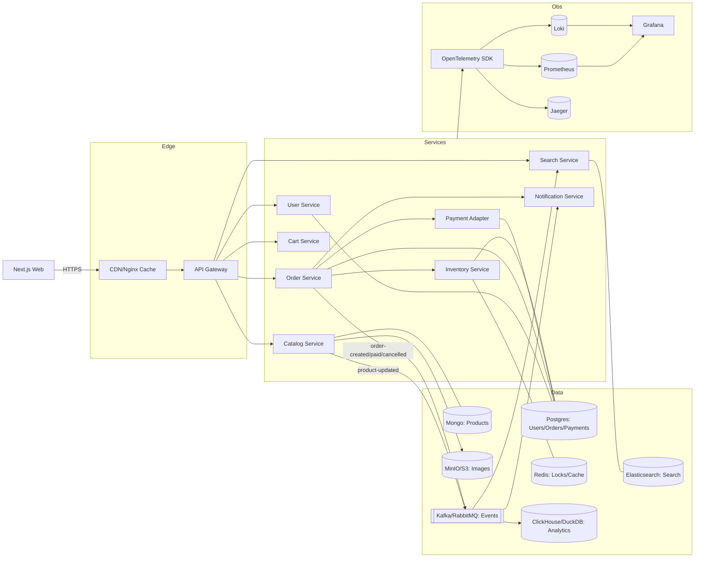

# Petty Kadai — Mini Amazon Capstone

Petty Kadai is a hands-on system-design curriculum and capstone project to build a small-scale e‑commerce platform (a “Mini Amazon”). You’ll practice production-grade architecture, reliability, security, performance, and observability—adding one capability per week and ending each week with a runnable, tested system.

Quick links:

- Curriculum: `docs/system-design-curriculum.md`
- Weekly modules: `docs/weeks/`
- Architecture overview: `docs/architecture/README.md`

## What we’re building

A learning-focused e‑commerce system with:

- User accounts and JWT auth
- Product catalog (NoSQL) with images in object storage and CDN-style caching
- Full‑text search (Elasticsearch)
- Shopping cart
- Inventory with correctness under contention (Redis locks)
- Checkout with Orders + Payment Adapter (Saga orchestration and compensations)
- Notifications (email/webhook)
- Event-driven integration via a message broker
- First-class observability: metrics, logs, traces, dashboards, and SLOs

Each week introduces one new concept/tool/service, with test-driven development and an end-of-week runnable stack.

## Finished architecture (high level)



## Tech stack

- Frontend: Next.js
- Backend: Go (chi) services
- Data: Postgres (users/orders/payments), MongoDB (catalog), Redis (cache/locks), Elasticsearch (search), MinIO/S3 (images)
- Messaging: RabbitMQ or Kafka
- Edge: Nginx (API gateway, simple CDN-like cache)
- Observability: OpenTelemetry, Prometheus, Grafana, Loki, Jaeger
- Packaging/Orchestration: Docker Compose (early weeks), Kubernetes (Kind/Minikube)
- Testing/Load: Unit + integration tests; k6/hey/Locust for performance

## Design considerations and principles

- Microservices with clear bounded contexts and data ownership
- Event-driven integration via broker; decoupled services
- Correctness where it matters (orders, payments, inventory); eventual consistency where acceptable (search, analytics)
- Sagas for cross-service transactions; compensating actions
- Idempotency and outbox pattern to ensure “exactly‑once” effects at scale
- Observability-first: RED metrics, tracing propagation, actionable alerts
- TDD by default: write failing tests, then implement, then refactor

## Functional requirements (high level)

- Auth: login, JWT issuance, gateway enforcement
- Catalog: create/update/list products with images
- Search: query by keywords/facets; near real-time index updates
- Cart: add/remove items; consistent totals; idempotent updates
- Inventory: reserve/decrement stock with distributed locks
- Checkout: create order, authorize payment, reserve inventory, notify
- Notifications: email/webhook for order status changes

## Non-functional requirements

- Latency: browse/search/cart p95 < 200ms (local target), checkout p95 < 400ms (without external latency)
- Availability: degrade gracefully with retries/timeouts/circuit breakers
- Scalability: stateless services, horizontal scale, cache layers, read replicas, sharding strategy
- DR: scripted backups/restores; RTO 10m, RPO 5m (dev simulation)
- Observability: metrics/logs/traces; SLOs with burn-rate alerts
- Security: TLS (dev), JWT with rotation, least-privilege creds, input validation, secrets hygiene, log redaction

## Design patterns used

- API Gateway, CDN cache
- Saga orchestration, Outbox, Idempotent consumer
- Cache-Aside, Read-Replica routing
- Retries with jitter, Timeouts, Circuit Breaker, Bulkheads, Backpressure
- Distributed locks (SET NX + TTL) for inventory correctness

## Database tuning considerations

- Proper indexes on high-cardinality filters and joins; avoid n+1
- Connection pooling and timeouts; prepared statements for hot paths
- Partitioning/sharding keys (user_id/order_id); read replicas for scale
- VACUUM/auto-analyze settings (Postgres); slow query logging and tuning
- Mongo: schema design for common query patterns; Elasticsearch: mappings and analyzers

## Scalability considerations

- Stateless services with externalized state; horizontal scale behind the gateway
- Brokered events to decouple and buffer load; DLQ and replay
- Caching at multiple layers (CDN, gateway, service, DB)
- Backpressure via queue depth, rate limits, and circuit breakers

## Security features

- JWT-based stateless auth at the edge and in services
- TLS (dev via mkcert), optional mTLS internally
- Rate limiting/WAF at gateway; input validation throughout
- Secrets management and least-privilege credentials for DB/broker
- Audit logging and PII redaction in logs

## Potential enhancements

- True multi-region deployment with global routing; active-active
- Service mesh (mTLS, traffic shifting, policy) and zero-trust patterns
- Advanced search features (synonyms, typo-tolerance, personalization)
- Recommendations and fraud scoring (ML)
- Internationalization (multi-currency, tax, locales)

## Current bottlenecks and risks (in dev profile)

- Single-node data stores; limited HA in local environment
- Eventual consistency in search/analytics by design
- Gateway as a single point until HA is introduced
- Simulated payment gateway; limited realism for PCI concerns (tokenization only)

## How to run (local)

Optional commands if you want to try the stack locally—see the curriculum weeks for detailed steps:

```bash
# Start core infra + services (Compose file added during the early weeks)
docker compose up -d

# Run unit/integration tests (language-specific per service)
make test # or go test ./... / npm test, depending on service

# Open dashboards (Prometheus/Grafana/Jaeger) when introduced in later weeks
```

## How we work: TDD + weekly runnable milestones

- Every week ends with a runnable demo (compose/k8s) and a documented test suite.
- Write tests first, implement behavior, keep tests green as you refactor.
- See “TDD and weekly runnable outcomes” in `docs/system-design-curriculum.md` for specifics.

---

If you’d like, ask to scaffold the initial folders and Docker Compose stack—we can spin up Week 1 now and start from tests.
