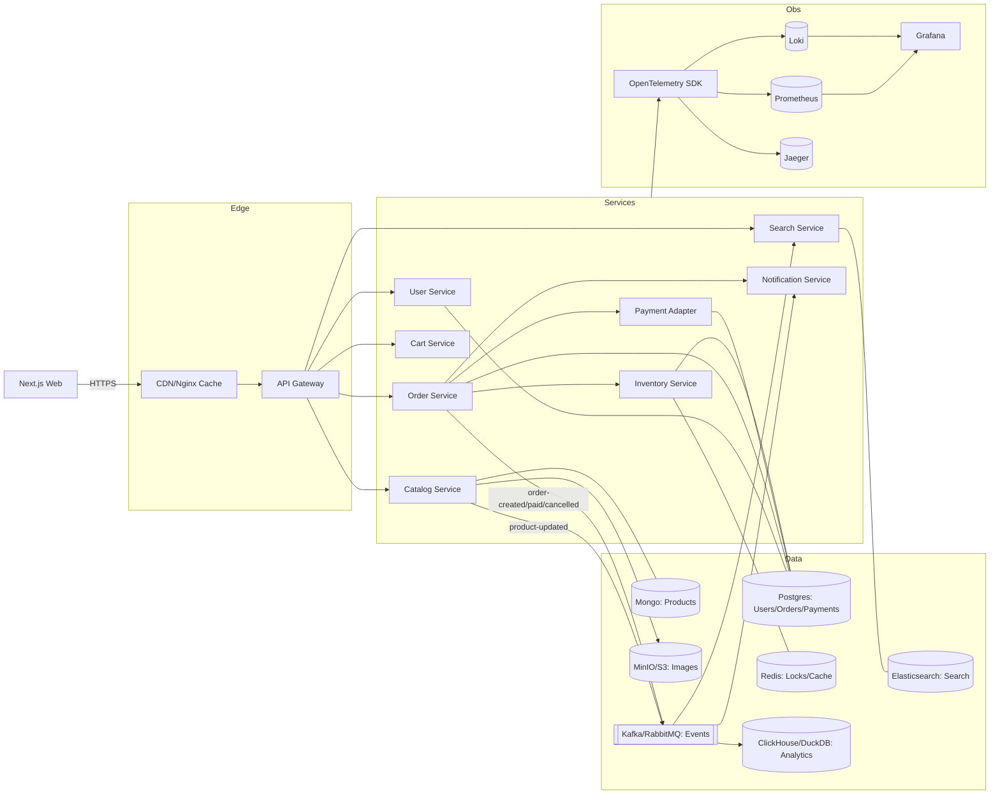

# Overall Architecture

Below is the high-level system architecture. This diagram will evolve as new components are introduced week by week.

```mermaid
flowchart LR
  subgraph Edge
    CDN[CDN/Nginx Cache]
    APIGW[API Gateway]
  end

  UI[Next.js Web]
  UI -->|HTTPS| CDN --> APIGW

  subgraph Services
    USER[User Service]
    CATALOG[Catalog Service]
    SEARCH[Search Service]
    CART[Cart Service]
    INVENTORY[Inventory Service]
    ORDER[Order Service]
    PAYMENT[Payment Adapter]
    NOTIFY[Notification Service]
  end

  APIGW --> USER
  APIGW --> CATALOG
  APIGW --> SEARCH
  APIGW --> CART
  APIGW --> ORDER
  ORDER --> PAYMENT
  ORDER --> INVENTORY
  ORDER --> NOTIFY

  subgraph Data
    PG[(Postgres: Users/Orders/Payments)]
    MONGO[(Mongo: Products)]
    REDIS[(Redis: Locks/Cache)]
    ES[(Elasticsearch: Search)]
    OBJ[(MinIO/S3: Images)]
    MQ[[Kafka/RabbitMQ: Events]]
    WAREHOUSE[(ClickHouse/DuckDB: Analytics)]
  end

  USER --- PG
  ORDER --- PG
  PAYMENT --- PG
  CATALOG --- MONGO
  SEARCH --- ES
  CATALOG --> OBJ
  INVENTORY --- PG
  INVENTORY --- REDIS

  %% Events
  CATALOG -- product-updated --> MQ
  ORDER -- order-created/paid/cancelled --> MQ
  MQ --> SEARCH
  MQ --> NOTIFY
  MQ --> WAREHOUSE

  %% Observability
  subgraph Obs
    OTEL[OpenTelemetry SDK]
    PROM[(Prometheus)]
    GRAF[Grafana]
    LOKI[(Loki)]
    JAEGER[(Jaeger)]
  end
  Services --> OTEL
  OTEL --> PROM
  OTEL --> LOKI
  OTEL --> JAEGER
  PROM --> GRAF
  LOKI --> GRAF
```
