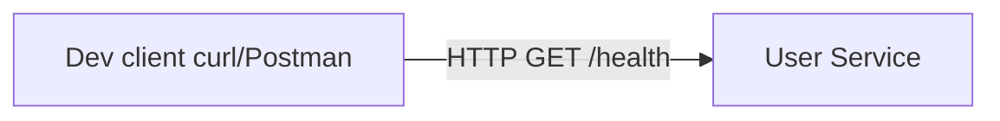

# Week 01 — Go service skeleton and scope (one tool)

tools-introduced: Go + chi (HTTP server)

concepts-covered:

- Functional vs non-functional requirements; transcript’s latency/availability framing
- Health endpoints, SLOs (<200ms for simple endpoints), simple capacity thinking

proposed-architecture:

- Single User service (`/health`) without databases, gateway, or frontend yet

changes-to-system-design:

- Establish service repo layout and conventions; no persistence yet

tasks-checklist:

- [ ] Initialize Go module (module path set)
- [ ] Implement `GET /health` with uptime/version
- [ ] Add structured logging (zap/slog) and config via env
- [ ] Add graceful shutdown and readiness/liveness probes
- [ ] Add Makefile/dev run script
- [ ] Document SLO for health endpoint and measure p95 locally

skills-required:

- Basic Go, HTTP handlers, middleware

prerequisites:

- Go toolchain installed

deliverables:

- Minimal service running locally

acceptance-criteria:

- `GET /health` returns 200 < 50ms locally; ctrl-c triggers graceful shutdown

## Proposed architecture diagram

