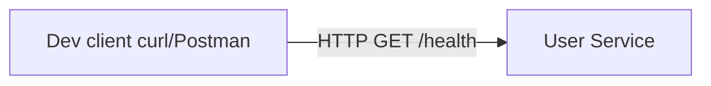

# Week 01 — Go service skeleton and scope (one tool)

tools-introduced: Go net/http (standard library HTTP server)

concepts-covered:

- Functional vs non-functional requirements; transcript’s latency/availability framing
- Health endpoints, SLOs (<200ms for simple endpoints), simple capacity thinking

proposed-architecture:

- Single User service (`/health`) without databases, gateway, or frontend yet

changes-to-system-design:

- Establish service repo layout and conventions; no persistence yet

tasks-checklist:

- [ ] Initialize Go module (module path set)
- [ ] Implement `GET /health` with uptime/version
- [ ] Add structured logging (zap/slog) and config via env
- [ ] Add graceful shutdown and readiness/liveness probes
- [ ] Add Makefile/dev run script
- [ ] Document SLO for health endpoint and measure p95 locally

skills-required:

- Basic Go, HTTP handlers, middleware

prerequisites:

- Go toolchain installed

deliverables:

- Minimal service running locally

acceptance-criteria:

- `GET /health` returns 200 < 50ms locally; ctrl-c triggers graceful shutdown

## Proposed architecture diagram

## Why start with a tiny User service?

- Lowest-friction vertical slice: a single endpoint to exercise routing, config, logging, tests, containerization, and CI basics without external infra.
- Sets the baseline for later services (catalog, inventory, orders) to copy structure and conventions.
- Enables TDD from day one: fast unit tests for handler behavior and JSON shape.

## Design choices and principles

- HTTP routing: standard library net/http with ServeMux; minimal middleware via net/http wrappers.
- 12‑factor friendly: configuration via env; no global/hidden state; deterministic startup/shutdown.
- Observability-ready: health/readiness endpoints and room to add structured logging and metrics later.
- SLO: p95 of health under 50ms locally; coarse but concrete target to start latency thinking early.

Notes on scope vs plan:

- Implemented this week: GET /health with uptime/version, unit tests, Dockerfile, Makefile targets.
- Deferred to later weeks (or stretch for Week 1): structured logging, readiness probe, graceful shutdown wiring with context timeouts.

## Structure today, scalable tomorrow

Current files:

- `services/user/main.go` – minimal router with `/health`
- `services/user/health_test.go` – unit tests for `/health`
- `services/user/Dockerfile` – multi-stage build

As services grow, graduate to:

- `internal/handlers` – HTTP handlers
- `internal/service` – business logic
- `internal/config` – env parsing and validation
- `pkg/middleware` – cross-cutting concerns (logging, trace IDs, timeouts)

This keeps handler code slim, improves discoverability, and allows reuse across services.

## Tests: current and near-term

Current:

- Unit test validates 200 status and stable JSON shape for `/health` (includes status, service name, version, uptime).

Add soon (optional in Week 1, required by Week 2):

- A tiny in-process HTTP test for end-to-end handler wiring.
- Latency smoke check (non-flaky): warn if p95 > 50ms locally.

Edge cases considered:

- Empty/invalid Accept headers (should still return JSON).
- Slow startup window (health should report initializing if we add readiness later).
- Large headers or query strings (ignored by health; handler should remain constant-time).

## BDD alongside TDD (lightweight)

We’ll keep TDD as the primary loop and layer a thin BDD spec for behavior clarity. Example scenario:

Scenario: Health endpoint reports service status
Given the service is running
When I GET /health
Then I receive HTTP 200
And the JSON includes status "ok", the service name, a semantic version, and a positive uptime

These specs live in README for now; we’ll bring a formal BDD tool later only if it adds value.

## Weekly concept summary

- One-tool focus: Go HTTP service with a single endpoint.
- Outcome: a runnable, tested service template to replicate for future microservices.
- Next: Week 2 Catalog API adds MongoDB and evolves structure (handlers/service/repo) with integration tests.
