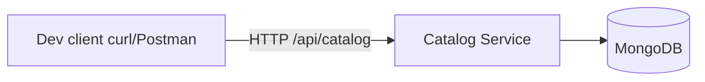

# Week 02 — Catalog API (one tool)

tools-introduced: MongoDB (document store)

concepts-covered:

- Flexible product schema; simple CRUD; validation; pagination

proposed-architecture:

- Add Catalog service exposing CRUD for products backed by MongoDB

changes-to-system-design:

- Define product schema (category, title, price, images[]); validation rules

tasks-checklist:

- [ ] Add MongoDB in dev (Compose) and wire DSN via env
- [ ] Implement Catalog API: create, get, list (with pagination), update
- [ ] Basic validation and error handling (400s for invalid payloads)
- [ ] Unit tests for handlers and repository; integration test against Mongo (dev container)

skills-required:

- Go handlers; Mongo driver basics; JSON validation

prerequisites:

- Week 01 running User service

deliverables:

- Catalog CRUD working locally with tests

acceptance-criteria:

- Create/list products succeeds; list paginates; tests pass (unit + basic integration)

## Proposed architecture diagram

