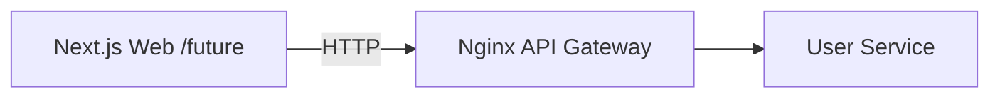

# Week 02 — API Gateway (one tool)

tools-introduced: Nginx (API gateway/edge)

concepts-covered:

- Edge concerns: routing, request/response normalization
- Rate limiting basics (token bucket) — configure but keep limits permissive

proposed-architecture:

- Add Nginx in front of the User service; still no auth or DB

changes-to-system-design:

- Introduce gateway layer; standardize headers and error format

tasks-checklist:

- [ ] Add Nginx container in dev
- [ ] Define routes: `/api/user/health` → User service
- [ ] Add basic rate limiting and 429 response
- [ ] Add request ID header propagation

skills-required:

- Nginx basics, reverse proxy configuration

prerequisites:

- Week 01 running User service

deliverables:

- Gateway routes working; 429 observed under aggressive local limit

acceptance-criteria:

- `GET /api/user/health` through Nginx returns 200; rate limiter blocks > N RPS

## Proposed architecture diagram

