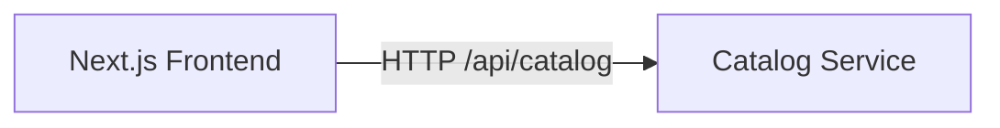

# Week 03 — Frontend (Next.js) (one tool)

tools-introduced: Next.js (App Router)

concepts-covered:

- Simple SSR/ISR page; calling backend API; environment handling

proposed-architecture:

- Create a minimal Next.js app with a Products page that lists items from Catalog API

changes-to-system-design:

- Define frontend routes and env configuration for API base URL

tasks-checklist:

- [ ] Scaffold Next.js app in `/frontend` with a `/products` page
- [ ] Fetch products from Catalog service (client/server-side as preferred)
- [ ] Basic UI: list with name, price, image placeholder
- [ ] Add a simple e2e test (Playwright/Cypress) or integration test for the page

skills-required:

- Next.js basics; fetch from API; simple component state

prerequisites:

- Weeks 01–02 running (Catalog API available)

deliverables:

- Frontend can list products from Catalog

acceptance-criteria:

- Visiting `/products` shows items from the Catalog API; test passes

## Proposed architecture diagram

