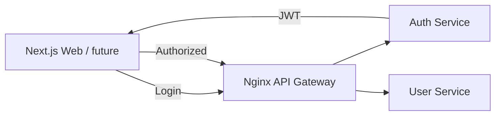

# Week 03 — Auth service and JWT (one concept/tool)

tools-introduced: JWT (go-jose/jwx) + minimal Auth service

concepts-covered:

- Stateless auth (JWT) vs server-side sessions per transcript; claim design; expiry

proposed-architecture:

- Add Auth service for login issuing JWT; gateway validates JWT on protected paths

changes-to-system-design:

- Define authn/authz boundaries; no DB yet (use in-memory users)

tasks-checklist:

- [ ] Implement Auth service `POST /auth/login` (in-memory user store)
- [ ] Sign JWT with HS256 dev secret; add expiry and roles
- [ ] Gateway validates JWT and forwards user claims to backend
- [ ] Protect `/api/user/profile` mock endpoint (returns 401 without JWT)

skills-required:

- JWT basics; HMAC signing; middleware in Go and Nginx

prerequisites:

- Weeks 01–02 running

deliverables:

- JWT login flow working; protected endpoint accessible only with token

acceptance-criteria:

- Valid token → 200, invalid/expired → 401 via gateway

## Proposed architecture diagram

