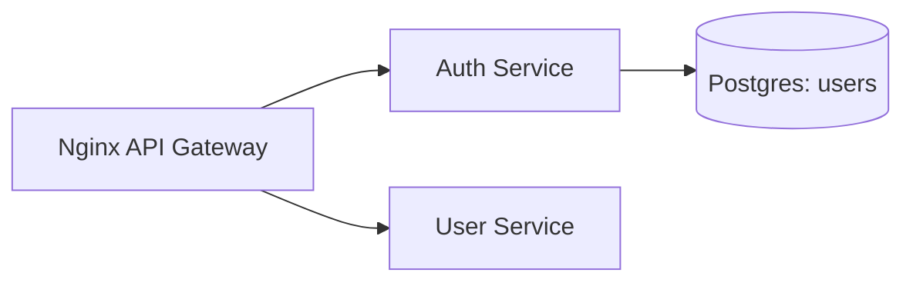

# Week 04 — Postgres for Users (one tool)

tools-introduced: Postgres (pgx + sqlc migrations)

concepts-covered:

- Strong consistency for identity data; schema design; migrations

proposed-architecture:

- Persist users in Postgres; Auth service validates against DB (still tokens via HS256)

changes-to-system-design:

- Add Postgres single instance; DB user with least-privilege; connection pooling

tasks-checklist:

- [ ] Add Postgres container in dev
- [ ] Create `users` table and migration scripts
- [ ] Wire Auth service to query users via pgx/sqlc
- [ ] Add health check for DB (readiness)
- [ ] Seed one demo user securely (hashed password)

skills-required:

- SQL basics, migrations, database connectivity from Go

prerequisites:

- Weeks 01–03 running

deliverables:

- Login against Postgres-backed users

acceptance-criteria:

- Auth login only succeeds for seeded user; DB health exposed; tests pass

## Proposed architecture diagram

