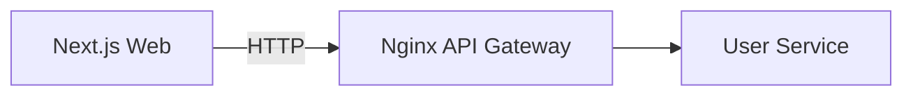

# Week 05 — Next.js web app skeleton (one tool)

tools-introduced: Next.js (App Router)

concepts-covered:

- Server-rendered UI basics; API integration through gateway; simple caching headers

proposed-architecture:

- Add Next.js frontend to call gateway `/api/user/health` and render status

changes-to-system-design:

- Introduce web client; define base API URL and error display patterns

tasks-checklist:

- [ ] Create Next.js app scaffold
- [ ] Add page to show health via gateway call
- [ ] Configure environment variables for API base URL
- [ ] Add basic layout and error boundary

skills-required:

- React/Next.js fundamentals; fetch/axios; env config

prerequisites:

- Weeks 01–04 running

deliverables:

- Web app that renders health status from backend

acceptance-criteria:

- Visiting `/` shows gateway health OK and handles error state gracefully

## Proposed architecture diagram

