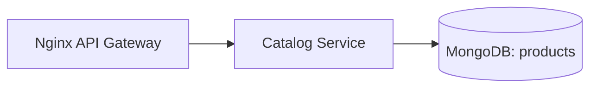

# Week 07 — MongoDB for Catalog (one tool)

tools-introduced: MongoDB (mongo-go-driver)

concepts-covered:

- Flexible schema for diverse products; indexes; connection lifecycle

proposed-architecture:

- Wire Catalog service to Mongo; replace in-memory with Mongo persistence

changes-to-system-design:

- Add Mongo container; credentials; collection with indexes on common filters

tasks-checklist:

- [ ] Add Mongo in dev; configure URI and credentials
- [ ] Define product schema (document) and indexes
- [ ] Replace in-memory store with Mongo DAO
- [ ] Health/readiness checks for Mongo connectivity

skills-required:

- Mongo modeling; Go driver usage; context timeouts

prerequisites:

- Weeks 01–06 running

deliverables:

- Catalog reads served from Mongo; list/get endpoints unchanged externally

acceptance-criteria:

- Seeded data present in Mongo; endpoints pass integration tests

## Proposed architecture diagram

