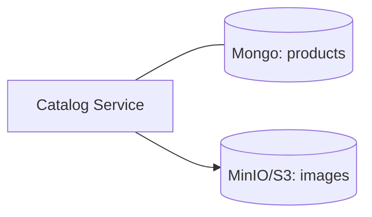

# Week 08 — Object storage for images (one tool)

tools-introduced: MinIO (S3-compatible)

concepts-covered:

- Store images outside DB; signed URLs; basic media lifecycle

proposed-architecture:

- Catalog stores image metadata and S3 URL; MinIO holds actual images

changes-to-system-design:

- Add MinIO; create bucket; update product model with image URLs

tasks-checklist:

- [ ] Add MinIO in dev; create bucket and credentials
- [ ] Write upload endpoint for product images (Catalog)
- [ ] Store object key/URL in product document
- [ ] Serve images via gateway static route

skills-required:

- S3 APIs; multipart upload basics; content types

prerequisites:

- Weeks 01–07 running

deliverables:

- Product image upload + retrieval working locally

acceptance-criteria:

- Upload succeeds; image loads via URL; metadata persists in Mongo

## Proposed architecture diagram

