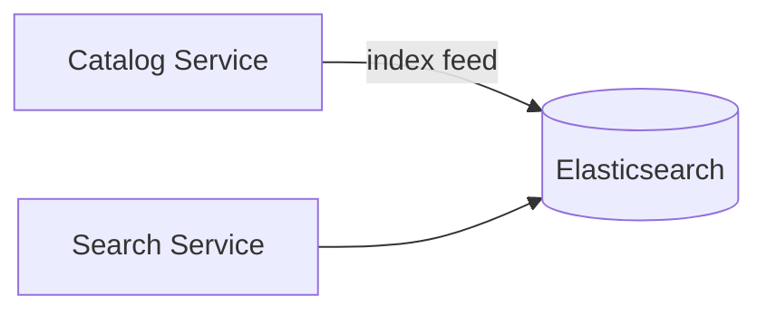

# Week 11 — Elasticsearch for Search (one tool)

tools-introduced: Elasticsearch/OpenSearch

concepts-covered:

- Full-text indexing, analyzers, mappings; near-real-time updates

proposed-architecture:

- Connect Search service to ES; index products; serve queries from ES

changes-to-system-design:

- Add ES container; define index and mappings; backfill from Catalog

tasks-checklist:

- [ ] Add ES in dev; set credentials
- [ ] Create index with mappings; load products
- [ ] Update Search to query ES; fallback to in-memory on error
- [ ] Add index health check and freshness metric

skills-required:

- ES basics; mappings; Go ES client

prerequisites:

- Weeks 01–10 running

deliverables:

- Search served from ES with better relevance

acceptance-criteria:

- New products searchable within <5s; query returns ranked results

## Proposed architecture diagram

