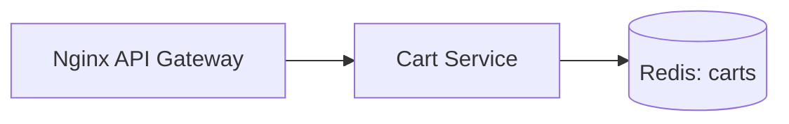

# Week 13 — Redis for Cart storage (one tool)

tools-introduced: Redis (go-redis)

concepts-covered:

- Fast key-value storage; TTL for guest carts; connection pooling

proposed-architecture:

- Replace in-memory Cart store with Redis hashes/sets

changes-to-system-design:

- Add Redis container; define key schema (`cart:{userID}`)

tasks-checklist:

- [ ] Add Redis in dev; configure address/creds
- [ ] Implement Cart DAO using Redis
- [ ] TTL for anonymous carts; no TTL for authenticated carts
- [ ] Health/readiness checks for Redis connectivity

skills-required:

- Redis data modeling; Go client usage; timeouts

prerequisites:

- Weeks 01–12 running

deliverables:

- Cart persisted in Redis; endpoints unchanged externally

acceptance-criteria:

- Cart survives service restarts; TTL works for guest carts

## Proposed architecture diagram

