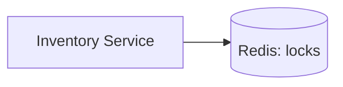

# Week 15 — Distributed locks for Inventory (one concept)

tools-introduced: Redis locking pattern (SET NX + TTL) — reuses Redis

concepts-covered:

- Critical section for stock reservation; TTL to prevent dead locks; retries with backoff

proposed-architecture:

- Inventory acquires lock per SKU before reserve; decrements stock safely

changes-to-system-design:

- Define lock key scheme (`lock:sku:{id}`) and TTL; add lock metrics

tasks-checklist:

- [ ] Implement lock acquire with TTL and release
- [ ] Re-read stock after lock; decrement atomically
- [ ] Add retry with jitter on lock contention
- [ ] Add metric for lock wait time and failures

skills-required:

- Redis atomic ops; concurrency patterns; metrics

prerequisites:

- Weeks 01–14 running (Redis available)

deliverables:

- Correct last-item behavior under contention

acceptance-criteria:

- 10 concurrent buyers for 1-item SKU → ≤1 success, others fail gracefully

Diagram:

