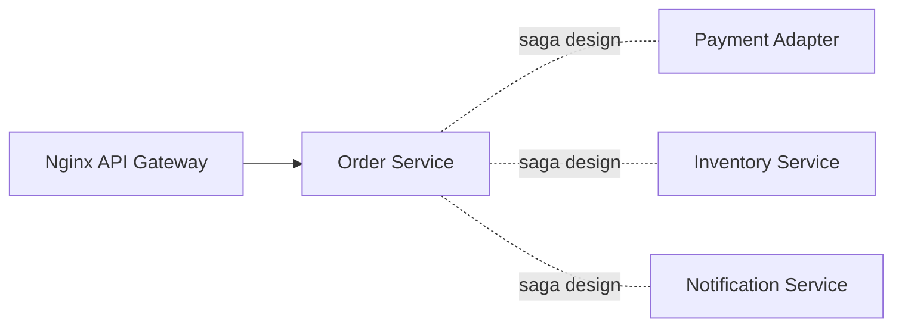

# Week 16 — Order service + Saga orchestration (one microservice/concept)

tools-introduced: Order service (Go/chi), saga orchestrator (design only)

concepts-covered:

- Order lifecycle; compensations; outbox pattern

proposed-architecture:

- Add Order service with states (pending/paid/cancelled); define saga steps without broker yet

changes-to-system-design:

- Define `/api/order` routes; data model in-memory; record state transitions

tasks-checklist:

- [ ] Implement Order API: create, get status, cancel
- [ ] Design saga flow: payment → inventory → notify (stubs)
- [ ] Implement outbox table/in-memory for future broker emission
- [ ] State transition validation and tests

skills-required:

- Go handlers, state machines, design of compensations

prerequisites:

- Weeks 01–15 running

deliverables:

- Order service with state machine and outbox stub

acceptance-criteria:

- Happy path and failure path tests pass; compensations designed and documented

Diagram:

