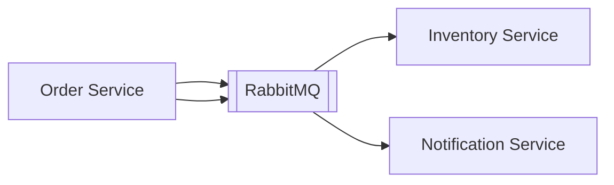

# Week 17 — Message broker for events (one tool)

tools-introduced: RabbitMQ (streadway/amqp) or Kafka (choose one; default RabbitMQ)

concepts-covered:

- Event-driven decoupling; durable queues; idempotent consumers

proposed-architecture:

- Add broker; Order emits `order.created/paid/cancelled`; Inventory/Notify subscribe

changes-to-system-design:

- Add broker container; define exchanges/queues and routing keys; outbox → publisher

tasks-checklist:

- [ ] Add RabbitMQ in dev; create exchanges/queues
- [ ] Publisher in Order service with outbox relay
- [ ] Consumer in Inventory to handle reservation messages (log for now)
- [ ] Dead-letter queue for failed messages

skills-required:

- AMQP basics; publisher/consumer patterns; idempotency keys

prerequisites:

- Weeks 01–16 running

deliverables:

- Events flow from Order to Inventory/Notify through broker

acceptance-criteria:

- Messages persist if consumer down; replay works; no duplicates processed

Diagram:

