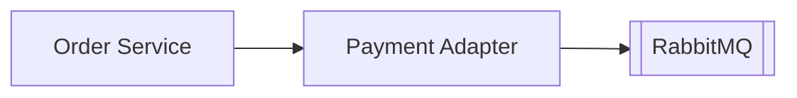

# Week 18 — Payment adapter (one microservice)

tools-introduced: Payment Adapter service (fake gateway integration)

concepts-covered:

- Tokenization to avoid PCI scope; retries/timeouts; compensations

proposed-architecture:

- Add Payment Adapter; Order calls adapter; adapter returns token/authorized result

changes-to-system-design:

- Define `/api/payment/authorize` (internal); use fixed delay to simulate gateway

tasks-checklist:

- [ ] Implement adapter: authorize, refund endpoints (simulated)
- [ ] Timeouts and retries with jitter at Order client
- [ ] Emit `payment.authorized/failed` events
- [ ] Update saga to call adapter and publish outcome

skills-required:

- HTTP clients with timeouts; resilience basics; event emission

prerequisites:

- Weeks 01–17 running

deliverables:

- Payment flow integrated into saga with simulated gateway

acceptance-criteria:

- Fault injection (slow/fail) triggers retries and compensations; order state consistent

Diagram:

