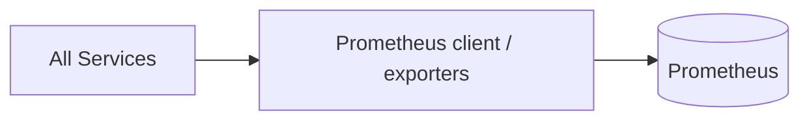

# Week 19 — Metrics with Prometheus (one tool)

tools-introduced: Prometheus (metrics); service exposure via /metrics

concepts-covered:

- RED metrics; per-endpoint histograms; alert basics (burn-rate later)

proposed-architecture:

- Add Prometheus; instrument services; export /metrics and create dashboards (Grafana later)

changes-to-system-design:

- Define key metrics and labels; ensure low cardinality; scrape configs

tasks-checklist:

- [ ] Add Prometheus in dev
- [ ] Instrument gateway and core services (User, Catalog, Cart, Inventory, Order)
- [ ] Add histograms for latency and counters for errors
- [ ] Create starter dashboard JSON (or note for next week)

skills-required:

- Prometheus client usage in Go; metric design

prerequisites:

- Weeks 01–18 running

deliverables:

- Metrics visible in Prometheus; basic graphs for latency/errors

acceptance-criteria:

- p95 latencies visible; error rates tracked per endpoint

Diagram:

