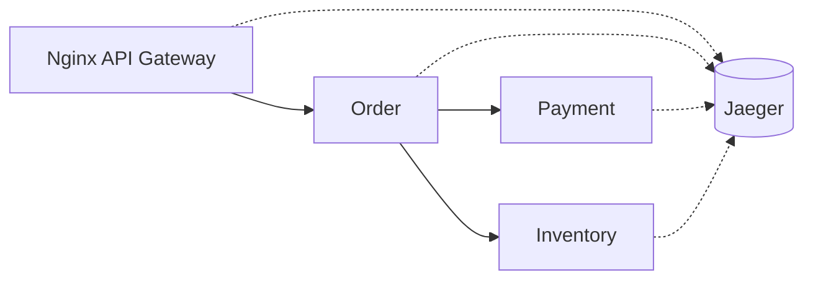

# Week 20 — Tracing with Jaeger (one tool)

tools-introduced: Jaeger (tracing) + OpenTelemetry SDK (Go)

concepts-covered:

- Distributed tracing; propagation; spans and attributes; sampling

proposed-architecture:

- Add Jaeger; instrument gateway and services; propagate trace headers across calls

changes-to-system-design:

- Add traceparent propagation; add span attributes for business context (order_id, sku)

tasks-checklist:

- [ ] Add Jaeger in dev
- [ ] Add OpenTelemetry SDK to services; create spans around handlers and clients
- [ ] Verify end-to-end trace across gateway → order → payment → inventory
- [ ] Add error span events on failures

skills-required:

- OTel tracing in Go; context propagation; exporters

prerequisites:

- Weeks 01–19 running

deliverables:

- End-to-end traces visible; bottlenecks attributable to specific spans

acceptance-criteria:

- A checkout trace contains all involved services with correct timing and status

Diagram:

